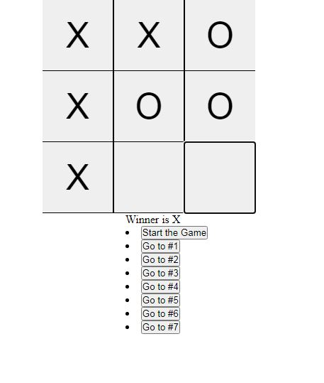

# FIRST REACT APP

Just a simple React aplication to start learning the framework: https://richardbmk.github.io/reac-tic-tac-toe/

This is some source I use:
- [React Oficial Docs] (https://reactjs.org/tutorial/tutorial.html)
- [React Tic Tac Toe] (https://www.youtube.com/watch?v=hJpz2V5Tf2w&list=PLeh2GWv22bmQ3-QagKItbrJTQaHoe5Kji&index=7)

##### Stack (Front-End & Back-End)
* ForntEnd:
    * HTML and CSS
    * REACTjs

